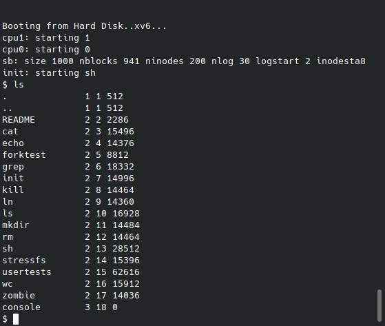
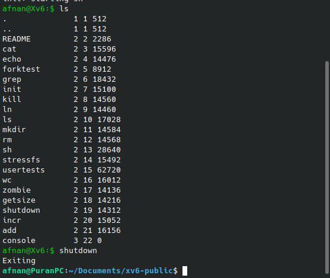

# Dissecting-Xv6
### Installation in Debian System
Clone the official Xv6 repository from [here](https://github.com/mit-pdos/xv6-public).We need an emulator to boot Xv6.We will use qemu for this purpose.To install qemu, run from your terminal ```sudo apt install qemu```.Then from where Xv6 was cloned , run `make` to compile Xv6.Then to launch the emulator , run `make qemu` and you will see qemu in a different window.If qemu doesn't launch , then run `sudo apt install qemu-system-x86` and then run `make qemu` again.This time , it should work.
Still, you might face problems like [this](https://stackoverflow.com/questions/70515788/booting-xv6-with-qemu) then [here](https://www.reddit.com/r/ManjaroLinux/comments/p4445x/help_xv6_installation_on_manjaro/) is a way around.

To run qemu in the same terminal you're using , run `make qemu-nox` instead of `make qemu`.

### Modifying Source Codes
After qemu is being launched , you will see following system calls by running `ls`


We can modify the source code and see the effects instantly.Lets say we want to replace the `$` sign with something else.To do this , go to `sh.c` file and change inside `getcmd` method.

```printf(2, ANSI_COLOR_GREEN "afnan@Xv6:$ " ANSI_COLOR_RESET);```

Add two lines at the top of this file
```
#define ANSI_COLOR_GREEN   "\x1b[32m"
#define ANSI_COLOR_RESET   "\x1b[0m"
```

Now quit from the qemu terminal pressing `cntrl+A` , release and then type x immediately(as you can see it's a tedious task and we will create a system call to exit from the terminal).Then run `make qemu-nox` again and see the result now


#### Adding a System call
Let's create a system call to exit from the qemu terminal.We name it as `shutdown`.So we want to do something that would enable us to exit from the terminal by just writing the command `shutdown`.

First create a file named `shutdown.c`.
```
#include "types.h"
#include "stat.h"
#include "user.h"

int main(int argc, char * argv[])
{
    printf(1, "Exiting\n");
    shutdown();
    exit();//eq to return zero
}
```
Notice that to print anything in console , we need to add a file descriptor as the first parameter of printf unlike C language.

Then in Makefile , add it in the UPROGS
```
UPROGS=\
	_cat\
	_echo\
	_forktest\
	_grep\
	_init\
	_kill\
	_ln\
	_ls\
	_mkdir\
	_rm\
	_sh\
	_stressfs\
	_usertests\
	_wc\
	_zombie\
 	_shutdown\
```
Add it also in EXTRA
```
EXTRA=\
	mkfs.c ulib.c user.h cat.c echo.c forktest.c grep.c kill.c\
	ln.c ls.c mkdir.c rm.c stressfs.c usertests.c wc.c zombie.c shutdown.c\
```
Now you can exit from the qemu terminal and run `make qemu-nox` again and see that `ls` will list `shutdown` as a system call.But running this command won't do anything for now.We've to add this system call to 4 following files

* **syscall.c**
Add the following line where similar lines exists
```extern int sys_shutdown(void);```
Then in the next block , add
```[SYS_shutdown] sys_shutdown,```
* **syscall.c**
Add the following line at the end
```#define SYS_shutdown 23```
* **usys.S**
Add the following line at the end
```SYSCALL(shutdown)```
* **user.h**
Add ```void shutdown(void);```

Now,there are two files which contain the methods for system calls.`sysfile.c` contains methods related to files and `sysproc.c` contains methods related to processes.We have to write a new method named `sys_shutdown` in `sysproc.c`.
```
void sys_shutdown(void){
  outw(0xB004, 0x0|0x2000);
  outw(0x604, 0x0|0x2000);
}
```
If everything's fine so far,then you can exit from qemu , run `make qemu-nox` and see the available sytem calls by running `ls`.Run the command `shutdown` and you will see the terminal exiting.


**NB**:I have already implemented few more sytem calls.You won't see add,incr,getsize etc for now if those aren't implemented.

#### System call to increment a number
First create a `incr.c` file
```
#include "types.h"
#include "user.h"
#include "fcntl.h"


//added by afnan
//converts string to int
int my_atoi(char *str)
{
    int i;
    int sign;
    int val;
    int nbr;

    i = 0;
    sign = 1;
    val = 0;
    nbr = 0;
    if (str[0] == '-')
    {
        sign = -1;
        str++;
    }
    i = 0;
    while(str[i] >= '0' && str[i] <= '9' && str[i] != '\0')
    {
        nbr = (int) (str[i] - '0');
        val = (val * 10) + nbr;
        i++;
    }
    i++;
    return (val * sign);
}


//give command : incr 7
//it will output 8
int main(int argc , char * argv[]){
    printf(1 , "%d\n" , incr(my_atoi(argv[1])));
    exit();
}#include "types.h"
#include "user.h"
#include "fcntl.h"


//added by afnan
//converts string to int
int my_atoi(char *str)
{
    int i;
    int sign;
    int val;
    int nbr;

    i = 0;
    sign = 1;
    val = 0;
    nbr = 0;
    if (str[0] == '-')
    {
        sign = -1;
        str++;
    }
    i = 0;
    while(str[i] >= '0' && str[i] <= '9' && str[i] != '\0')
    {
        nbr = (int) (str[i] - '0');
        val = (val * 10) + nbr;
        i++;
    }
    i++;
    return (val * sign);
}


//give command : incr 7
//it will output 8
int main(int argc , char * argv[]){
    printf(1 , "%d\n" , incr(my_atoi(argv[1])));
    exit();
}
```
modify the files which are needed to be.
* **syscall.c**
Add the following line where similar lines exists
```extern int sys_incr(void);```
Then in the next block , add
```[SYS_incr] sys_incr,```
* **syscall.c**
Add the following line at the end
```#define SYS_incr 24``
* **usys.S**
Add the following line at the end
```SYSCALL(incr)```
* **user.h**
Add ```int incr(int);```

Then add a method in `sysproc.c`
```
int sys_incr(void){
  int num;
  argint(0,&num); //retrieving first integer argument

  //cprintf("%d - Inside system call!",num);

  return num + 1;
}
```
Now exiting and running `make-qemu-nox` again will enable you to use `incr` command.


